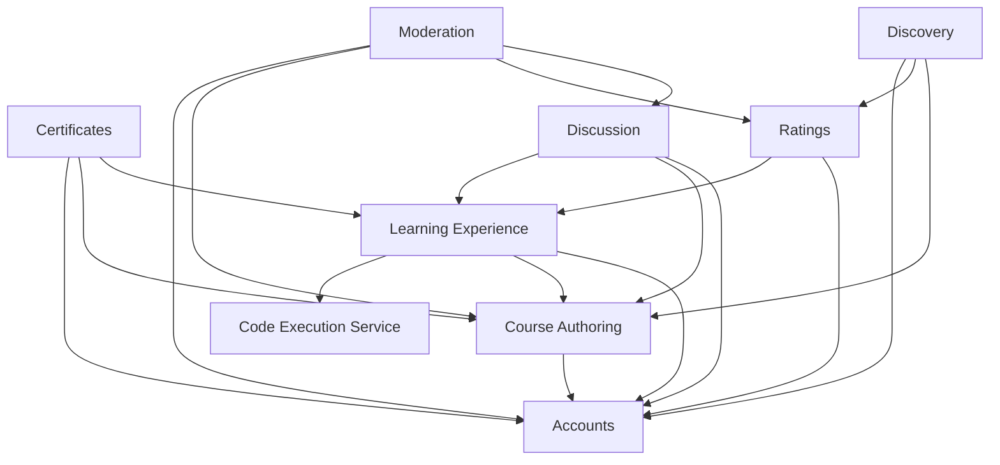
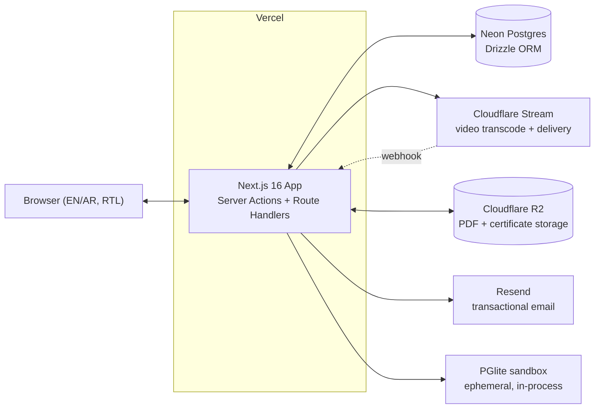
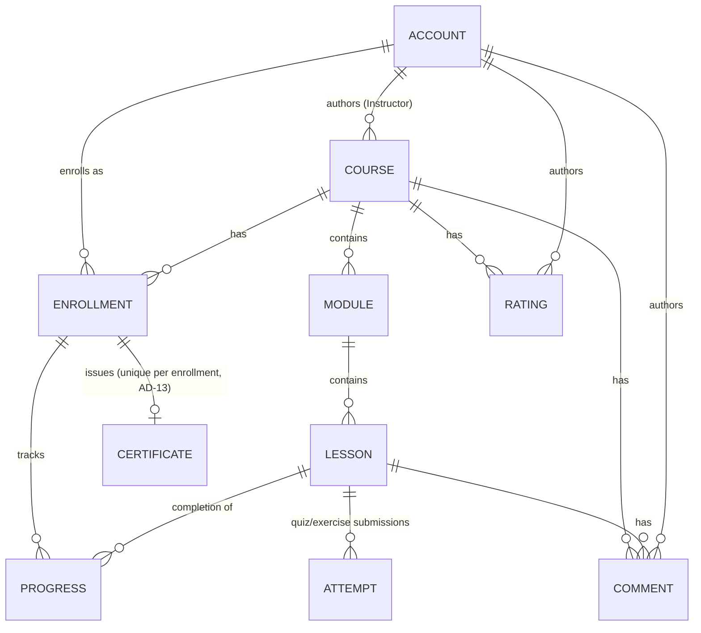

# Architecture Spine — Sanabel

## Design Paradigm

**Modular Monolith.** One Next.js full-stack app is the single system of record over one Postgres database. Domain modules (Accounts, Course Authoring, Learning Experience, Certificates, Discussion, Ratings, Discovery, Moderation) are directories under `lib/modules/*`, each owning its own schema slice and service functions; `app/` route/UI code never touches the database directly, only a module's service layer. A handful of capabilities that cannot or should not run in-process are the only carve-outs — video transcode/delivery, object storage, sandboxed code execution, transactional email — each reached through one narrow contract owned by the module that needs it, never called ad hoc from a route. This paradigm is chosen deliberately over a services/microservices split: Sanabel is built and operated by one person, and a monolith with enforced internal module boundaries gets nearly all the maintainability benefit of service decomposition without the deployment/ops burden a solo builder can't carry.

## Invariants & Rules

### AD-1 — Modular monolith with narrow external carve-outs

- **Binds:** all
- **Prevents:** premature service decomposition; independently-built epics inventing their own API/DB-access pattern instead of sharing one.
- **Rule:** Server Actions and Route Handlers are the only mutation boundary into Postgres. The only permitted out-of-process capabilities are video (Cloudflare Stream), object storage (Cloudflare R2), sandboxed code execution (PGlite, AD-8), and transactional email (Resend) — each behind one contract owned by a single module.

### AD-2 — Module ownership map

- **Binds:** all
- **Prevents:** two modules writing the same table (e.g. two features both mutating Progress), or a module reimplementing another's business rule instead of calling it.
- **Rule:** each table has exactly one owning module's service layer as its only writer:

| Module | Owns |
| --- | --- |
| Accounts | User, Session, Role |
| Course Authoring | Course, Module, Lesson (structure + content) |
| Learning Experience | Enrollment, Progress, Attempt (quiz/exercise submission history), completion computation |
| Certificates | Certificate |
| Discussion | Comment |
| Ratings | Rating |
| Discovery | (read-only composition of Course Authoring + Ratings; owns no tables) |
| Moderation | (soft-delete actions on other modules' rows via their service fns; owns no tables) |

### AD-3 — Cross-module access rule

- **Binds:** all
- **Prevents:** silent divergence in business rules (e.g. two different definitions of "is this Learner enrolled") because a shortcut query bypassed the owning module.
- **Rule:** a module mutates only its own tables directly. To read or write another module's data it calls that module's exported service function — never a raw Drizzle query against another module's schema.



### AD-4 — Autosave / concurrency contract

- **Binds:** Course Authoring (outline editor, lesson editors) — FR-12
- **Prevents:** the outline editor and a lesson-content editor, built as separate surfaces, choosing incompatible save granularity or silently losing concurrent edits.
- **Rule:** every Lesson has exactly two autosave field-groups — (a) outline metadata (title, order, Lesson Type) and (b) content body (the Lesson Type-specific payload) — each with its own debounced Server Action call and its own `updatedAt`-based optimistic version. Conflicting writes resolve last-write-wins per field-group, never whole-document overwrite. No third granularity is introduced by a Lesson Type-specific editor. `[DEFERRED]` same-field-group concurrent edits (e.g. two tabs editing one Lesson's content body at once) still silently drop the loser — acceptable for v1 since Sanabel has no multi-Instructor co-authoring of one Course; revisit if that ever becomes a feature.

### AD-5 — Upload lifecycle contract

- **Binds:** Course Authoring (upload UI), Learning Experience (learner-facing player/viewer) — FR-10, FR-11
- **Prevents:** the author-side status chip and the learner-side player disagreeing on what "ready" means; upload caps being enforced in one entry point but skipped in another.
- **Rule:** one canonical status enum — `queued | processing | ready | failed` — lives on the Lesson's media record. Video status is driven exclusively by Cloudflare Stream webhooks; PDF status is set synchronously after server-side type/size validation. FR-11 caps are enforced server-side, once, at that media kind's one upload-initiation Route Handler (one for video, one for PDF — not one shared handler for both, and never duplicated per calling UI surface) — never client-side, never re-implemented per surface.

### AD-6 — Role / authorization contract

- **Binds:** all Instructor-only or Admin-only surfaces — FR-3, FR-4
- **Prevents:** an Instructor-gated surface being hidden in the nav but still reachable by direct route, because one module checked the role and another didn't.
- **Rule:** Learner/Instructor/Admin are additive role flags on one Account row, never separate entities. Better Auth uses DB-backed sessions, not stateless JWT, specifically so an Admin's FR-4 role grant/revoke takes effect on the account's next request rather than waiting out a token's lifetime. Every module — UI route, Server Action, and Route Handler alike — authorizes through one shared pair of helpers: `requireRole(role)` asserts and throws `AuthorizationError` on failure (never silently returns false or `undefined`); `can(action, resource)` returns a boolean and never throws. No module writes its own role check or its own helper with different failure semantics.

### AD-7 — Completion / certificate-eligibility contract

- **Binds:** Learning Experience, Certificates — FR-20, FR-21, FR-25, FR-26
- **Prevents:** the progress bar, the "Continue" button, and Certificate issuance each computing "done" slightly differently (e.g. one counting an optional lesson, another not).
- **Rule:** one canonical `isLessonComplete()` / `isCourseComplete()` computation, owned by Learning Experience, is the sole input every other module reads for completion state. Every Lesson row (regardless of Lesson Type — Video, Text, PDF, Quiz, or Interactive Code Exercise are one entity per AD-2/FR-9, not three) carries a `required: boolean` (default `true`) so this computation has a stable input regardless of how PRD Open Question 6 (required vs. supplementary lessons) is later resolved. Certificate issuance is a persisted one-time write — an actual Certificate row inserted the first time `isCourseComplete()` returns true for an Enrollment — never a value recomputed live on each view; this is what makes FR-15's "an already-issued Certificate survives later Course changes" guarantee hold structurally rather than by convention. See AD-13 for the uniqueness constraint that makes this insert idempotent under concurrent completion.
- **Rule (Certificate content, FR-26):** Certificate content is a frozen snapshot, not a live join. `learnerName`, `courseTitle`, `instructorName`, and `completionDate` are copied onto the Certificate row at issuance time and never re-derived from live Account/Course data by any surface afterward — the in-app certificate view and the downloadable PDF both read the Certificate row's own frozen columns. A later Instructor rename, Course-title edit, or Learner display-name change never alters an already-issued Certificate.

### AD-8 — Code Execution Service boundary

- **Binds:** Course Authoring (exercise-definition schema), Learning Experience (submission/grading flow, including Quiz grading) — FR-9, FR-23, FR-24, cross-cutting code-execution-security NFR
- **Prevents:** exercise authoring and exercise-taking evolving incompatible ideas of what a "graded submission" is; any ad hoc in-process `eval`-style shortcut that would violate the sandboxing NFR; Quiz grading being implemented client-side with no analogous contract to anchor to.
- **Rule:** grading is invoked through exactly one contract — `submit(exerciseId, code) → {pass|fail, message}` — routed through the Code Execution Service, never executed inline in the request handler. v1 scope is fixed to SQL only, run against an ephemeral, in-memory PGlite instance per submission: no network egress, and the instance discarded after grading. `[ASSUMPTION → RESOLVED BY REVIEW]` PGlite runs in-process, single-threaded, and synchronously — a JS-side timer cannot preempt a blocking query on the same thread it would need to cancel, so isolation must sit one level up: each submission runs inside a dedicated Node `worker_thread` (or an equivalent isolated per-invocation process, never a Vercel Fluid Compute shared instance, which a hung PGlite call would stall for other learners' concurrent requests). The caller hard-kills the worker via `worker.terminate()` on a wall-clock timeout, with a Postgres `statement_timeout` set inside the PGlite session itself as a second, defense-in-depth layer. Memory is bounded by the worker's own heap limit. Multi-language support (PRD Open Question 10) extends this same contract later — it is not a reason to add a second one now.
- **Rule (Quiz grading, FR-24):** Quiz grading follows the identical contract shape and the identical non-negotiable — `submitQuiz(lessonId, answers) → {pass|fail, score, message}` — evaluated server-side inside a Server Action. The correct-answer key is never sent to the client in the Quiz lesson payload; a Learner's browser never has enough information to self-grade. Quiz attempts are persisted the same way Exercise submissions are (the shared `Attempt` entity under Learning Experience, per AD-2), so both graded Lesson Types feed `isLessonComplete()` (AD-7) through the same shape of evidence.

```mermaid
sequenceDiagram
  participant L as Learner (browser)
  participant SA as Server Action
  participant CE as Code Execution Service
  participant PG as PGlite (ephemeral)

  L->>SA: submit(exerciseId, code)
  SA->>CE: execute(exercise.dataset, code)
  CE->>PG: spawn dedicated worker_thread, load dataset into in-memory PGlite
  PG-->>CE: query result, or CE force-terminates worker on timeout
  CE-->>SA: pass|fail plus explanatory message
  SA-->>L: immediate feedback
  Note over CE,PG: worker.terminate() on wall-clock timeout + statement_timeout inside PGlite; worker discarded after one submission; no network egress
```

### AD-9 — i18n / content-language contract

- **Binds:** every UI-rendering surface (strings), Course Authoring and Discovery (content fields) — FR-33, FR-34
- **Prevents:** a module building a per-locale content-translation UI that FR-34 explicitly rules out, or another module assuming every Course exists in both English and Arabic.
- **Rule:** UI strings live only in next-intl message catalogs (`en.json` / `ar.json`); `dir="rtl"` is driven off active locale. Course content (title, description, Lesson body) is stored as single free-text fields — never per-locale columns. Sanabel does not auto-translate content. `[ADOPTED]` Every Course carries one `contentLanguage: 'en' | 'ar'` field, set by the Instructor at creation — this resolves PRD Open Question 3, since the UX spec (DESIGN.md) already commits to a "Taught in: Arabic/English" badge on every course-card, which presupposes this field existing; it was an oversight for the Deferred section to list it as undecided.

### AD-10 — Visibility / access-gating contract

- **Binds:** Discovery, Course Authoring (visibility field), Learning Experience (enrollment gate), Ratings (FR-30 requires Enrollment to rate) — FR-14, FR-17, FR-18, FR-19, FR-30
- **Prevents:** independently-built surfaces (browse, course detail page, lesson player, the rate/review form) each getting the Public/Unlisted/Enrolled/soft-deleted gate subtly wrong.
- **Rule:** one shared `canQueryCourse()` / `canAccessLesson()` authorization function is the single source of truth for: Discovery excluding Unlisted *and* soft-deleted (AD-11) courses from browse/search; the Course detail page rendering pre-signup; Lesson content routes requiring Enrollment; and the Rating form requiring Enrollment before an Account may submit one. No surface re-derives this gate independently.

### AD-11 — Soft-delete contract

- **Binds:** Moderation, Course Authoring (including ordinary post-publish editing, not just Admin actions), Learning Experience, Certificates — FR-32, FR-15
- **Prevents:** removing a Course, Module, or Lesson — whether via Admin moderation (FR-32) or an Instructor's ordinary post-publish edit (FR-15) — cascading into a hard delete of Enrollment/Progress/Certificate/Comment rows and breaking FR-15's guarantee that an already-issued Certificate survives later Course changes.
- **Rule:** removing a Course, Module, Lesson, Comment, or Rating — by any actor, through any surface — is always a soft-delete (a `removedAt` / status flag), never a hard delete. A soft-deleted Lesson is excluded from `isCourseComplete()`'s active-lesson set going forward but does not retroactively invalidate a Progress or Certificate row that already counted it complete.

### AD-12 — Environments

- **Binds:** deployment/CI, migration workflow
- **Prevents:** a solo builder having to hand-provision a staging environment per feature, and preview environments drifting from production schema.
- **Rule:** one production environment (Vercel + Neon primary branch). Every PR gets a Vercel preview deploy wired to an ephemeral Neon database branch (schema+data fork of primary), torn down on merge or close.

### AD-13 — Uniqueness & idempotency invariants

- **Binds:** Learning Experience (Enrollment), Ratings, Certificates — FR-19, FR-25, FR-26, FR-30
- **Prevents:** a double-enrollment splitting one Learner's Progress across two rows and silently blocking completion; an unconstrained duplicate Rating violating FR-30's "once per Course"; two concurrent completions (e.g. two devices) racing past AD-7's check and issuing two Certificates for one Enrollment.
- **Rule:** the database enforces, not just the application layer: a unique constraint on `Enrollment(accountId, courseId)`; a unique constraint on `Rating(accountId, courseId)`; a unique constraint on `Certificate(enrollmentId)` with an atomic insert-if-not-exists issuance path (`INSERT ... ON CONFLICT DO NOTHING` or equivalent), so a race produces one Certificate row, not two.

## Consistency Conventions

| Concern | Convention |
| --- | --- |
| Naming (entities, files, interfaces, events) | camelCase for TS identifiers, snake_case for DB columns (Drizzle's default mapping); a module's directory name under `lib/modules/` matches its name in AD-2's ownership table |
| Data & formats (ids, dates, error shapes, envelopes) | IDs are UUIDv7 (time-sortable) on every table; timestamps are UTC `timestamptz`; a Server Action never throws across the client boundary — it returns a discriminated union `{ok: true, data} \| {ok: false, error: {code, message}}` |
| State & cross-cutting (mutation, errors, logging, config, auth) | mutation only via Server Actions/Route Handlers (AD-1, AD-3); authorization only via `requireRole()`/`can()` (AD-6); structured JSON logging to Vercel's log drain — no dedicated logging/observability stack in v1, consistent with solo-maintained launch scale; numerals render as Western Arabic digits (0–9) regardless of active language, matching the UX spec |
| Accessibility (PRD §7 NFR) | color-contrast AA is already structurally enforced via DESIGN.md's paired color tokens; keyboard operability and screen-reader semantics remain v1 best-effort per the PRD's own framing (aspirational, not a launch gate) — stated explicitly here rather than left unaddressed |
| Search (FR-17) | Postgres native full-text search (`tsvector` on Course title/description/category) — no dedicated search service; matches v1's small course corpus and cost-sensitivity |

## Stack

| Name | Version |
| --- | --- |
| Next.js | 16 (App Router, React 19) — `[ASSUMPTION]` 15.5 (Maintenance LTS) is the fallback if a v16-specific issue blocks launch |
| TypeScript | 5.x |
| Tailwind CSS | v4, with shadcn/ui component source (already set by UX DESIGN.md) |
| Drizzle ORM | latest stable |
| Postgres | 17, hosted on Neon (serverless, scale-to-zero) |
| Better Auth | latest stable (email/password + Google + GitHub OAuth) |
| next-intl | latest stable (App Router, RTL/ICU support for Arabic) |
| Cloudflare Stream | managed service — inherited from PRD |
| Cloudflare R2 | managed service (PDF uploads, certificate files) |
| PGlite (`@electric-sql/pglite`) | Postgres 17 compiled to WASM — SQL exercise sandbox |
| Resend + React Email | latest stable — transactional email |
| Playwright (headless-browser HTML-to-PDF) | latest stable — certificate generation renders an HTML template through a real browser engine rather than `@react-pdf/renderer`'s custom layout engine, which the web-verification review found has a long-running, still-active Arabic bidi rendering bug history; a browser's native bidi text-shaping is the safer default given the bilingual-correctness NFR names certificate rendering explicitly |
| Deployment | Vercel |

## Structural Seed





```text
sanabel/
  app/
    [locale]/                     # next-intl locale segment (en | ar)
      (marketing)/                # public: home, browse, course detail (pre-signup)
      (learner)/                  # authenticated learner surfaces: my-learning, course home, lesson viewer
      (instructor)/                # Instructor-only: My Courses, course builder / outline editor
      (admin)/                     # Admin-only: moderation queue
    api/                           # webhook + upload Route Handlers (Cloudflare Stream webhook, PDF upload)
  lib/
    modules/
      accounts/                    # User, Session, Role -- service layer + Drizzle schema slice
      course-authoring/            # Course, Module, Lesson -- service layer + schema slice
      learning-experience/         # Enrollment, Progress, completion -- service layer + schema slice
      certificates/                # Certificate issuance + PDF render
      discussion/                  # Comment
      ratings/                     # Rating
      moderation/                  # soft-delete/removal actions, calling other modules' own service fns
      code-execution/              # Code Execution Service contract + PGlite adapter
    auth/                          # Better Auth config, requireRole()/can() helper
    db/                            # Drizzle client, schema barrel, migrations
    i18n/                          # next-intl config, message catalogs (en.json, ar.json)
  emails/                          # React Email templates (Resend)
  drizzle/                         # generated migrations
```

## Deferred

- **Multi-language code exercises beyond SQL** (PRD Open Question 10) — AD-8's Code Execution Service contract is designed to extend to this later; not decided which sandbox (e.g. a Piston/Judge0-style multi-language judge) it would add.
- **Verifiable, publicly-linkable certificates** (PRD Open Question 2) — v1 ships a downloadable file only; a unique Credential ID is cheap to retrofit if Certificate rows are given a stable ID now, but the verification page/API itself is not designed.
- **Pre-publish review queue for Public courses** (PRD Open Question 1) — Unlisted visibility is the only pre-public gate in v1.
- **CAPTCHA / rate-limiting on signup and comments** (PRD Open Question 9) — no bot-abuse architecture decided.
- **Account deletion / data export** (PRD Open Question 8) — no data-lifecycle/GDPR-style deletion cascade designed; AD-11's soft-delete pattern is a starting point but a real account-deletion flow needs its own design pass.
- **Threaded comments** — v1 is flat/chronological per the PRD assumption; no thread data model designed.
- **Video captions/transcripts beyond Cloudflare Stream's built-in auto-captions** (PRD Open Question 7) — no additional captioning pipeline designed.
- **Observability / on-call / uptime SLA** — explicitly out of scope for v1 per the PRD; structured console logging (Consistency Conventions) is the only floor, revisit if usage outgrows manual monitoring.
- **Same-field-group concurrent edits** (AD-4) — two tabs/devices editing one Lesson's content body at once still silently drops the loser; acceptable for v1 since Sanabel has no multi-Instructor co-authoring of a single Course. Revisit if co-authoring is ever added.
- **Cloudflare Stream's actual state model → AD-5's 4-state enum mapping** — a real implementation detail (Stream exposes more granular states, e.g. `ready` can fire before `pctComplete=100`); left for the dev-story level rather than fixed at this altitude.
- **Featured/curated course listing and thin-catalog empty state** (PRD Open Question 11) — v1 Discovery renders only real query results; an empty Browse/Search result set shows a fixed empty-state message (already specified at the epic/story level — see `epics.md` Story 3.1 and UX-DR15), never a hand-curated substitute list. No `featured` field exists on Course; introducing one is a future design decision requiring an ownership call (Instructor self-nomination vs. Admin curation via Moderation) not made here.
