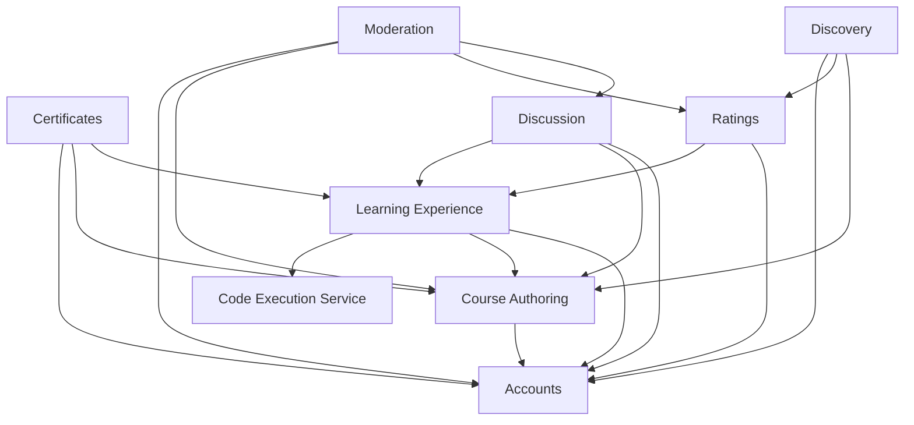
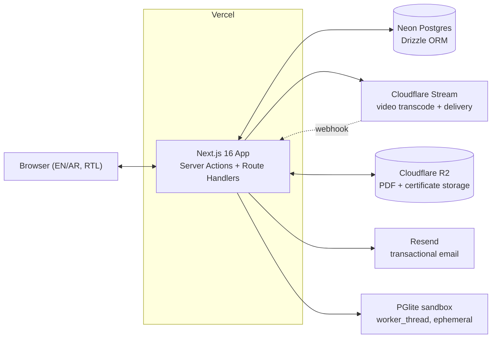

# Solution Design — Sanabel

## 0. What This Document Is

[ARCHITECTURE-SPINE.md](ARCHITECTURE-SPINE.md) is the terse, enforceable contract — the thirteen `AD`s a future builder (including a future Ahmed, or an agent working from a story file) must follow so independently-built pieces of Sanabel don't diverge. This document is its companion: the reasoning behind those decisions, the alternatives that were weighed and rejected, and enough narrative context that picking this project back up in six months doesn't mean re-deriving it from scratch. Where the spine says *what*, this says *why*. If the two ever disagree, the spine wins — this document explains; it doesn't govern.

It builds on the [PRD](../../prds/prd-BMAD%20Test-2026-07-30/prd.md) and its [addendum](../../prds/prd-BMAD%20Test-2026-07-30/addendum.md), and the [UX design](../../ux-designs/ux-BMAD%20Test-2026-08-02/DESIGN.md) — read those first for product intent and visual language. This document assumes both.

## 1. Design Paradigm: Why a Modular Monolith

Sanabel is built and operated by one person. That single fact should drive more architectural decisions than any technology preference. A services/microservices split — separate deployables for, say, course authoring, video processing orchestration, and the learning experience — buys you independent scaling and independent deployment, at the cost of operational surface area: multiple things to deploy, multiple things to monitor, network calls where function calls used to be, and distributed-transaction problems where a single database transaction used to suffice. None of that cost is worth paying for a solo-maintained platform at launch scale.

The alternative that captures nearly all of the *maintainability* benefit of service decomposition — the thing that actually matters here — without the operational cost, is a **modular monolith**: one deployable, one database, but internal module boundaries that are enforced, not just suggested. Each domain (Accounts, Course Authoring, Learning Experience, Certificates, Discussion, Ratings) owns its own tables and its own service layer; other modules reach it only through that service layer, never through a raw query against its schema. This is what AD-1 through AD-3 encode. The payoff: a future epic — course authoring, say — can be built without its author needing to understand Learning Experience's internals, only its published contract. That's the same payoff a service boundary gives you, without needing to stand up a second deployable to get it.

The genuine exceptions — capabilities that *cannot* run in-process — are named explicitly rather than left to accumulate ad hoc: video transcoding/delivery (Cloudflare Stream), object storage (Cloudflare R2), sandboxed code execution (a dedicated worker process, see §5), and transactional email (Resend). Each is a narrow, single-purpose integration owned by exactly one module, not a general-purpose "external services" grab bag.

## 2. Stack, and Why Each Piece Was Chosen (verified August 2026)

The frontend layer — React, Tailwind, shadcn/ui — was already set by [DESIGN.md](../../ux-designs/ux-BMAD%20Test-2026-08-02/DESIGN.md); the rest of the stack fills in around it.

| Layer | Choice | Why (alternatives considered) |
| --- | --- | --- |
| Full-stack framework | **Next.js 16** (App Router, React 19) | The natural framework given React was already chosen; App Router has been stable since v13.4 and is the default for new projects. Next.js 16 is the current Active LTS as of mid-2026; 15.5 (Maintenance LTS) is the fallback if a v16-specific issue blocks launch. Rejected: a separate SPA + API backend (Express/NestJS) — strictly more moving parts for a solo builder with no benefit Next.js doesn't already provide. |
| Database | **Postgres 17 on Neon** | Neon's serverless/scale-to-zero billing fits a cost-sensitive, low-traffic-at-launch product — you don't pay for idle compute between visits. Considered Supabase (an all-in-one platform with bundled auth/storage/realtime) but rejected it: Sanabel's auth is already covered by Better Auth and its storage by Cloudflare R2, so Supabase's bundled extras are dead weight, and Neon's narrower scope pairs more cleanly with Vercel's per-PR preview deploys (a Neon branch per preview, AD-12). |
| ORM | **Drizzle** | Lighter, SQL-level control, no code-generation step, and better cold-start performance on serverless/edge than Prisma — the 2026 default recommendation for new TypeScript projects on Postgres. Prisma remains a reasonable alternative if a future maintainer prefers its more abstracted API. |
| Auth | **Better Auth** | As of early 2026, Better Auth absorbed Auth.js (formerly NextAuth), which is now maintenance-only — security patches, no new features. Better Auth is self-hosted (sessions live in Sanabel's own database, not a third-party dashboard), has first-class Next.js App Router support, and Postgres/Drizzle adapters. It also made the DB-backed-session decision in AD-6 straightforward — sessions are just rows we control. |
| i18n | **next-intl** | Purpose-built for App Router (Server Components, no workarounds), with native RTL and ICU plural support for Arabic — directly load-bearing given Sanabel's bilingual-first mandate. next-i18next's App Router support only landed in March 2026 and is still rough around the edges. |
| Video | **Cloudflare Stream** | Inherited from the PRD/addendum's own research (usage-based, ~$1/1,000 min stored + $5/1,000 min delivered as of mid-2026 — see §7's note on a pricing discrepancy versus the PRD addendum's figures). Not re-litigated here. |
| Object storage | **Cloudflare R2** | Zero egress fees matter for a no-revenue product; pairs naturally with an already-committed Cloudflare Stream account. Used for PDF lesson uploads and generated certificate files. |
| Email | **Resend + React Email** | Free tier (3,000 emails/month) comfortably covers launch-scale verification/reset/notification volume; React/Next.js-native templating keeps transactional email in the same language as the rest of the app. |
| Certificate rendering | **Playwright** (headless-browser HTML-to-PDF) | Flipped from an initial `@react-pdf/renderer` pick — see note below. |
| Code sandbox (v1, SQL only) | **PGlite** (`@electric-sql/pglite`) in a dedicated Node `worker_thread` | See §5 — the highest-stakes technical decision in the system, with its own section. |
| Deployment | **Vercel** | Paved path for Next.js; per-PR preview deploys pair naturally with Neon's database branching (AD-12). |

Two of these deserve a sentence of "why," beyond the table: **certificate rendering** was originally scoped as `@react-pdf/renderer`, and got flipped to Playwright after the reviewer gate's web-verification pass found a long-running, still-active bug history in that library's Arabic bidi (right-to-left) text rendering — exactly the failure mode Sanabel's bilingual-correctness NFR calls out for certificates by name. A real browser's native bidi text-shaping engine is the safer default, not a fallback held in reserve. **Deployment** briefly considered running the whole app on Cloudflare Workers instead, since Stream and R2 are already Cloudflare — but Next.js support for Workers (via `@opennextjs/cloudflare`) is less mature for full App Router feature parity than Vercel's native support — not worth the friction for a solo intermediate-level builder when Stream/R2 work fine as plain APIs regardless of where the app itself runs.

## 3. Module Architecture

### 3.1 Ownership

Every table in the system has exactly one owning module — the only code path allowed to write it. This is AD-2, and it exists so that "who decides X" never becomes a question two different epics answer differently:

| Module | Owns |
| --- | --- |
| Accounts | User, Session, Role |
| Course Authoring | Course, Module, Lesson (structure + content) |
| Learning Experience | Enrollment, Progress, Attempt (quiz/exercise history), completion computation |
| Certificates | Certificate |
| Discussion | Comment |
| Ratings | Rating |
| Discovery | *(read-only composition of Course Authoring + Ratings — owns no tables of its own)* |
| Moderation | *(soft-delete actions on other modules' rows via their own service functions — owns no tables of its own)* |

### 3.2 Dependency Direction

The dependency graph below (also in the spine, AD-3) is itself a rule, not just documentation: an edge means "may call," and the graph is intentionally acyclic. Accounts sits at the bottom because almost everything needs to know who's asking; Discovery and Moderation sit at the top because nothing depends on them. This shape came out of the reviewer gate's incompatible-units pass, which caught three missing edges in the first draft (Certificates→Accounts for the name printed on a certificate, Discussion→Learning Experience for enrollment-gated comment visibility, Discovery→Accounts for the instructor bio shown on a course card) — a good example of why the adversarial review step exists: each of those was a real FR the first draft's graph would have silently under-served.



### 3.3 System Context



## 4. Core Data Model

Names and relationships only — attribute-level decisions that are themselves invariants (like `Course.contentLanguage` or `Lesson.required`) live in the spine's `AD`s, not duplicated here.

```mermaid
erDiagram
  ACCOUNT ||--o{ COURSE : "authors (Instructor)"
  ACCOUNT ||--o{ ENROLLMENT : "enrolls as"
  COURSE ||--o{ MODULE : contains
  MODULE ||--o{ LESSON : contains
  COURSE ||--o{ ENROLLMENT : has
  ENROLLMENT ||--o{ PROGRESS : tracks
  LESSON ||--o{ PROGRESS : "completion of"
  LESSON ||--o{ ATTEMPT : "quiz/exercise submissions"
  ENROLLMENT ||--o| CERTIFICATE : "issues (unique per enrollment)"
  COURSE ||--o{ COMMENT : has
  LESSON ||--o{ COMMENT : has
  COURSE ||--o{ RATING : has
  ACCOUNT ||--o{ COMMENT : authors
  ACCOUNT ||--o{ RATING : authors
```



A `Lesson` is one row regardless of Lesson Type (Video, Text, PDF, Quiz, or Interactive Code Exercise) — FR-9 is explicit that a Lesson has exactly one Lesson Type at a time, so Quiz and Exercise are *variants* of Lesson, not separate entities. The first draft of this design briefly drifted from that (an early version of the completion rule referred to "Lesson/Quiz/Exercise rows" as if three tables existed) — the reviewer gate caught the inconsistency against the PRD's own data model and it's corrected in the spine's AD-7.

## 5. The Code Execution Sandbox — Why This Got the Most Scrutiny

The PRD flags Interactive Code Exercises as "the single largest technical-complexity addition in this PRD relative to the brief," and treats sandboxing as a launch-blocking security NFR, not a hardening pass to add later. That combination — real public traffic, executing learner-submitted code, at launch — earned this decision the most rigor in the whole design.

**v1 scope is fixed to SQL only.** The PRD's own worked examples (UJ-1, UJ-2) are both SQL exercises, and PRD Open Question 10 explicitly leaves multi-language support as an open, unscoped question. Building a general multi-language judge (a Piston- or Judge0-style service) for a v1 that only needs SQL would be over-building — and Piston's own public API changed its terms in February 2026 to require non-commercial-only authorization, making a dependency on it riskier to take on than it would have looked a year earlier anyway.

**The sandbox itself: PGlite, inside a dedicated worker thread — not PGlite alone.** The initial draft of this design picked PGlite (Postgres 17 compiled to WASM, from the ElectricSQL/PGlite project) as the whole sandbox: no network egress by construction, ephemeral in-memory instances, a small footprint (~3MB), and — being real Postgres — correct handling of arbitrary SQL. That much held up. But the reviewer gate's web-verification pass caught a real gap: PGlite runs **in-process, single-threaded, and synchronously**. A JavaScript-side timeout cannot preempt a query that's blocking the same thread the timeout would need to run on — so "enforce a hard time limit" isn't something the calling code can actually do if PGlite is just called directly from a Server Action. The fix, now in AD-8: each submission spawns a dedicated Node `worker_thread` (never a shared Vercel Fluid Compute instance, which a hung query would stall for other learners' concurrent requests), and the caller force-kills that worker with `worker.terminate()` on a wall-clock timeout. A Postgres `statement_timeout` set inside the PGlite session itself is a second, cheap layer of defense underneath that. This is the shape of what the reviewer gate is *for*: the PGlite choice itself was sound, but its integration pattern as first drafted had a real security gap that only surfaced under adversarial, web-verified review.

```mermaid
sequenceDiagram
  participant L as Learner (browser)
  participant SA as Server Action
  participant CE as Code Execution Service
  participant PG as PGlite (ephemeral)

  L->>SA: submit(exerciseId, code)
  SA->>CE: execute(exercise.dataset, code)
  CE->>PG: spawn dedicated worker_thread, load dataset into in-memory PGlite
  PG-->>CE: query result, or CE force-terminates worker on timeout
  CE-->>SA: pass|fail plus explanatory message
  SA-->>L: immediate feedback
  Note over CE,PG: worker.terminate() on wall-clock timeout + statement_timeout inside PGlite; worker discarded after one submission; no network egress
```

The whole thing sits behind one contract — `submit(exerciseId, code) → {pass|fail, message}` — specifically so that whenever multi-language support does get built (PRD Open Question 10), it extends this contract rather than requiring exercise-authoring and exercise-taking to be redesigned around a second, different execution path.

## 6. Cross-Cutting Contracts

A handful of rules exist purely because more than one part of the system needs the *same* answer to a question, and nothing stops two independently-built parts from picking different answers if the question isn't settled once, centrally.

- **"Is this Learner allowed to see this?"** — one function, `canQueryCourse()` / `canAccessLesson()`, is the only place Public/Unlisted, Enrolled/not-Enrolled, and soft-deleted state get checked. It's called from Discovery's browse filter, the Course detail page, the Lesson content route, and the Rating form (rating requires enrollment, same family of question as accessing lesson content). Before this was pinned down as one shared function, four different surfaces would each have needed to reimplement the same three-way gate correctly — and the PRD's own §4.3 note flags this exact area ("sign-in required to view Lesson content" narrowing the brief's stricter original line) as already having had one round of ambiguity.
- **"Is this Lesson/Course done?"** — one function, `isLessonComplete()` / `isCourseComplete()`, owned by Learning Experience, feeds the progress bar, the "Continue" button, and Certificate issuance. Certificate issuance itself is a **persisted one-time write** — a Certificate row is inserted the first time completion flips to true, never recomputed live — which is what actually makes FR-15's "an already-earned certificate isn't retroactively revoked by later course changes" promise hold structurally rather than by convention. A database-level uniqueness constraint on `Certificate(enrollmentId)` (AD-13) closes a race the data-integrity review flagged: two devices finishing the last lesson at nearly the same moment could otherwise both pass the completion check and both try to issue a certificate.
- **Who can do Instructor/Admin things, and how fast does a revoke take effect?** Better Auth's session is database-backed rather than a stateless JWT specifically so that when Ahmed revokes someone's Instructor role (FR-4), it takes effect on their very next request — not whenever a cached token happens to expire. Every authorization check goes through one of two named helpers with pinned, consistent behavior: `requireRole()` throws on failure, `can()` returns a boolean and never throws — a small thing, but exactly the kind of inconsistency (does a failed check throw or silently return false?) that two builders working from the same spine, months apart, would otherwise guess differently.
- **Removing something.** Every delete — an Admin removing a Course for moderation, or an Instructor ordinarily editing a published course and taking a Lesson out — is a soft-delete, never a hard one. This one rule is what keeps FR-15's certificate-survival guarantee and FR-32's "removal visible to the author" requirement from fighting each other: a hard delete of a Lesson a Learner already completed would otherwise orphan their Progress and Certificate rows.
- **Uniqueness the database enforces, not just the application.** `Enrollment(accountId, courseId)`, `Rating(accountId, courseId)`, and `Certificate(enrollmentId)` are all unique constraints at the database level, not just checks in application code. The data-integrity review pass specifically called out that a Learner double-enrolling (e.g. two tabs, or a retried request) would otherwise silently split their Progress across two rows and could block them from ever completing the course they're actually working through — a subtle failure mode that's cheap to close with a constraint and expensive to debug without one.

## 7. Environments & Deployment

One production environment: Vercel (app) + Neon's primary branch (database). Every pull request gets a Vercel preview deploy wired to an ephemeral Neon branch — a full schema+data fork of primary — torn down automatically on merge or close. This gives a solo builder something close to a real staging environment for free, without hand-provisioning anything per feature, and it's the natural pairing given that Neon's branching model was one of the reasons it was chosen over Supabase in the first place (§2).

**A note for reconciliation, not an architecture decision:** the PRD's addendum states Cloudflare Stream pricing as roughly $5/1,000 minutes stored plus $1/1,000 minutes delivered; live pricing found during this design pass is the reverse — approximately $1/1,000 minutes stored and $5/1,000 minutes delivered. This doesn't change the choice of Cloudflare Stream, but it does affect the actual cost math behind FR-11's upload caps, which are currently draft `[ASSUMPTION]` values in the PRD. Worth a quick correction pass on the PRD/addendum before those caps are finalized.

## 8. Source Tree

```text
sanabel/
  app/
    [locale]/                     # next-intl locale segment (en | ar)
      (marketing)/                # public: home, browse, course detail (pre-signup)
      (learner)/                  # authenticated learner surfaces: my-learning, course home, lesson viewer
      (instructor)/                # Instructor-only: My Courses, course builder / outline editor
      (admin)/                     # Admin-only: moderation queue
    api/                           # webhook + upload Route Handlers (Cloudflare Stream webhook, PDF upload)
  lib/
    modules/
      accounts/                    # User, Session, Role -- service layer + Drizzle schema slice
      course-authoring/            # Course, Module, Lesson -- service layer + schema slice
      learning-experience/         # Enrollment, Progress, Attempt, completion -- service layer + schema slice
      certificates/                # Certificate issuance + PDF render (Playwright)
      discussion/                  # Comment
      ratings/                     # Rating
      moderation/                  # soft-delete/removal actions, calling other modules' own service fns
      code-execution/              # Code Execution Service contract + PGlite/worker_thread adapter
    auth/                          # Better Auth config, requireRole()/can() helper
    db/                            # Drizzle client, schema barrel, migrations
    i18n/                          # next-intl config, message catalogs (en.json, ar.json)
  emails/                          # React Email templates (Resend)
  drizzle/                         # generated migrations
```

## 9. What's Deliberately Not Decided Yet

The full list, with its reasoning, lives in the spine's [Deferred](ARCHITECTURE-SPINE.md#deferred) section — ten items, each named on purpose rather than silently skipped, spanning things genuinely out of scope for v1 (a pre-publish review queue, CAPTCHA/rate-limiting, verifiable certificates) and things that depend on information that doesn't exist yet (whether multi-language code exercises turn out to matter, whether certificates start getting cited to employers). Not repeated here to avoid two copies of the same list drifting out of sync — this document's job was the *why* behind what got decided, and for the deferred items the honest answer is simply "not enough signal yet to decide well," which the spine already states as tersely as it needs to.

## 10. How This Was Built — Process Note

This design went through a structured review gate before being finalized: a deterministic lint pass, then four independent, parallel adversarial reviews — a rubric walk against a good-spine checklist, a web-verification pass that fact-checked every named technology against current (2026) sources, an incompatible-units attack that tried to construct two spine-compliant builders who'd still diverge, and a data-integrity pass focused on races and orphaned foreign keys. All four returned real findings, not noise — the PGlite worker-thread fix (§5), the missing dependency-graph edges (§3.2), the certificate-PDF library flip (§2), and the uniqueness constraints (§6) all came out of that process rather than the first draft. That's reflected in the spine's `AD`s directly; this document just carries the story of how they got there.

## 11. Suggested Next Steps

1. **Adopt this spine as a `bmad-spec` companion** — turning the PRD + this architecture into a preservation-validated machine contract (`SPEC.md`) is the natural next artifact, and keeps the `AD` IDs stable for downstream epic/story work to cite directly.
2. **`bmad-create-epics-and-stories`** — break the PRD's feature groups into epics and stories, using AD-2's module map as the natural epic boundary (Accounts, Course Authoring, Learning Experience, Certificates, Discussion, Ratings, Moderation, i18n line up closely with the PRD's own §4 sections).
3. **Correct the Cloudflare Stream pricing figures** in the PRD addendum (§7 above) before FR-11's cost caps are finalized.
